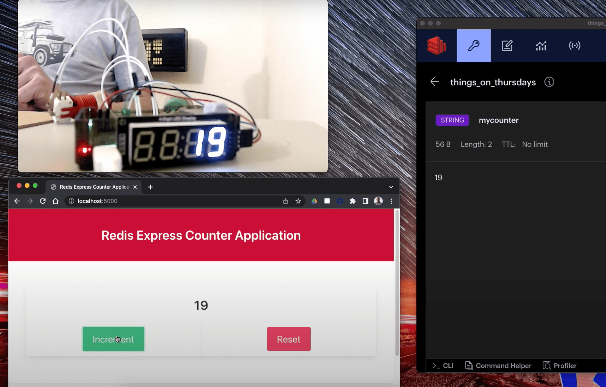

# Redis Counter Project

Counting with Redis, a Raspberry Pi with TM1637 7 segment display and a web interface.  Code in Python and Node.js.  

The aim of this project is to demonstrate how the current value of the count, stored in Redis, can be displayed and updated simultaneously from multiple displays.  I demonstrate using multiple instances of a web interface, plus the 7 segment display and an arcade button attached to a Raspberry Pi.

This project was created as part of my [Things on Thursdays](https://simonprickett.dev/things-on-thursdays-livestreams/) IoT livestreaming series for Redis.  Check out the videos for this project below:

* [Quick Preview of the project working](https://www.youtube.com/watch?v=zUvBzoQJiPQ)
* [Episode 1](https://www.youtube.com/watch?v=NJyR8FKb9aI&t=8s)
* [Episode 2](https://www.youtube.com/watch?v=Ad7zHs5ViWw&t=22s)

## Shopping List

If you want to build one of these, you'll need to have/buy the following items (links to specific suppliers, others are available - Google the items to find suppliers in your country to avoid foreign exchange and import costs):

* A [Raspberry Pi](https://www.raspberrypi.com/products/) (Model 3A, 3B or any model 4) - get whichever you have or can find, as there's a shortage right now.  The 3B is a solid all rounder to use on other future projects too.
* A decent power supply as this will have to power the Pi and the LEDs.  You'll want a [USB C](https://www.raspberrypi.com/products/type-c-power-supply/) one if using a Raspberry Pi 4, or a [micro USB version](https://www.raspberrypi.com/products/micro-usb-power-supply/) for all other Pi models.  Make sure to get one with the right wall plug for your country!
* A [Micro SD card](https://www.mymemory.co.uk/memory/memory-cards/micro-sd.html) (8gb should do, larger won't hurt).  You may need a micro SD to regular SD card adapter to connect the card to your laptop/desktop machine to write the Pi OS image to it.  Many micro SD cards come with this adapter.
* Optional: A case for the Raspberry Pi that still lets you access the GPIO ports.  I use this one in smoke grey from Adafruit: ([case for Pi 3](https://www.adafruit.com/product/2256) but there are lots of other options (check out [this one for the Pi 4](https://shop.pimoroni.com/products/pibow-coupe-4?variant=29210100170835) from Pimoroni for example).  You don't strictly need one of these, but it keeps things tidy and helps protect the Pi from accidental damage.
* A 4 digit TM1637 7 segment display.  There's many variations of these, so take a look at eBay.  Just make sure to get 4 digits, and pick a colour that appeals to you.  You don't need one that can be chained to others, so the ones with one set of connectors are fine.  Find a display with this [eBay search](https://www.ebay.co.uk/sch/i.html?_nkw=tm1637). 
* One [green](https://thepihut.com/products/official-sanwa-arcade-button-long-life?variant=31934166270014) and one [red](https://thepihut.com/products/official-sanwa-arcade-button-long-life?variant=31934166368318) arcade button.  Anything similar to the ones linked will do, get bigger or smaller ones according to your own preference.
* 8 [female to female jumper wires](https://shop.pimoroni.com/products/jumper-jerky?variant=348491271) (4 to connect the TM1637 and 2 for each of the arcade buttons).  Having a few different colours helps with identifying the wires when connecting things up, but isn't strictly necessary.  The link is for a pack of 40, so you only need to buy the one pack.

## Raspberry Pi / 7 Segment Display / Arcade Buttons Setup

### Raspberry Pi Setup

TODO

### Attaching the TM1637

TODO

### Attaching the Arcade Buttons

TODO

## Redis Setup

The fastest way to get started is to create yourself [a Redis database in the cloud](https://redis.com/try-free/).  Once you've signed up and created a database, make a note of the host, port, and password... you'll need these later.

Use the free tier, you don't need to add a payment method.

## Optional: RedisInsight

This is optional, and free, but worth using if you want to see what's happening in your Redis database:

[Download a copy of RedisInsight](https://redis.com/redis-enterprise/redis-insight/) - once you've installed RedisInsight use the host, port and password for your Redis database to connect.

## Software Setup

Once you have built the hardware and got your Redis host, port and password it's time to setup the software that we'll use to display and update the counter.

### For the Web Interface

Follow the instructions in the [`web/README.md`](web/README.md) file.

### For the Raspberry Pi

Follow the instructions in the [`raspberry-pi/README.md`](raspberry-pi/README.md) file.

